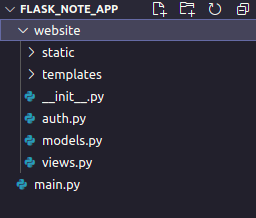
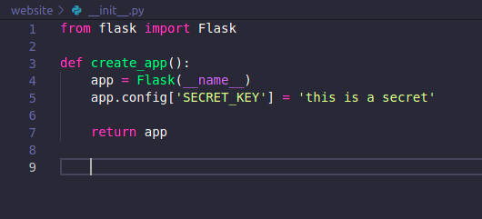
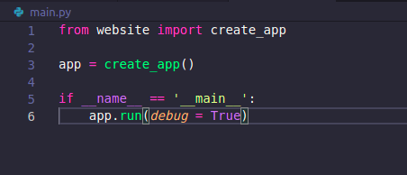
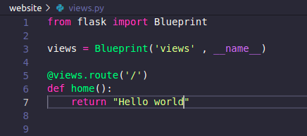
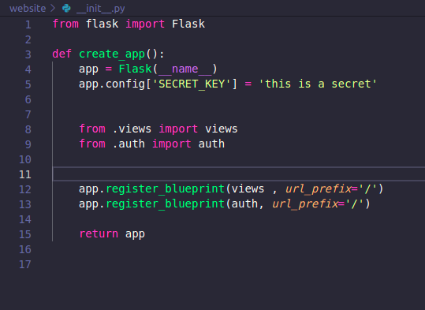
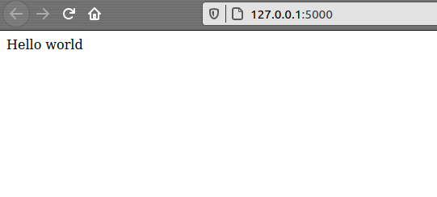

# Part 1 : Setting up

## Creating the basic app structure
First create the folders and the files shown below. It is the basic structure. Here the ``__init__.py`` converts the website folder
into a python package .So we will be able to import this **website** folder as a module.

## Activating the virtual environment

Creating a virtual environment

    python3 -m venv venv

Running the virtual environment

    source venv/bin/activate

## Installing python packages with pip

    (venv) $ pip install flask

When you execute this command, pip will not only install Flask, but also all of its
dependencies. You can check what packages are installed in the virtual environment
at any time using the pip freeze command:

    (venv) $ pip freeze
    click==7.1.2
    Flask==1.1.2
    itsdangerous==1.1.0
    Jinja2==2.11.3
    MarkupSafe==1.1.1
    Werkzeug==1.0.1

 

For login

    (venv) $ pip install flask-login

For database

    (venv) $ pip install flask-sqlalchemy

 

# Part 2 : Creating a very basic hello world app

In the ``__init__.py`` we will create a function named **create_app** and call it from **main.py**

In the main.py we will import the app and run it

 

## Creating routes/views

In the views.py we are creating blueprint for the routes

Now in the ``__init__.py`` we will register the blueprint and run the app.

The Hello world

# Part3 : Making the whole app

Now we will just start making the app

# Part 4
## Deploying the app in HEROKU

 
Creating a Prockfile
    
    touch Procfile

 
Now we will be using gunicorn webserver.
For this we have to add the below line inside the Procfile.

    web: gunicorn main:app

 

Since the app will be using green unicorn server and app socket so we need to install gunicorn

    pip install gunicorn

 

Now add a text file named **requirements.txt**

    touch requirements.txt

Now copy the packages and dependencies in the requirements.txt file

    pip freeze > requirements.txt

>Now just add , commit and push it in the **github** repo.

 

 

# Part 5
## Using HEROKU with gui(easy)

- Select an app name
- Select the deployment method as github
- Connect your github repo account
- enable the automatic deploy and deploy the app.

## Well done.😎😎👌👊
 
 

# The End

